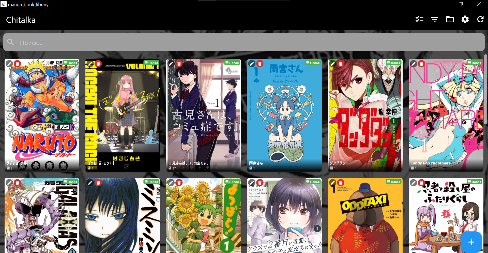
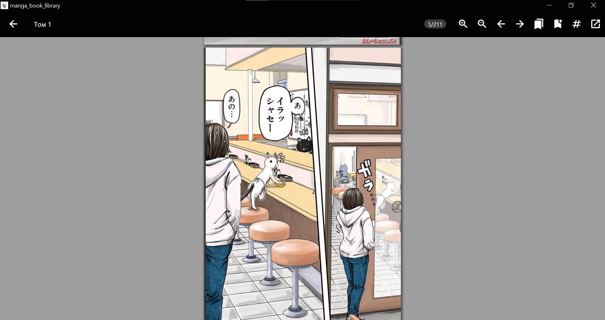
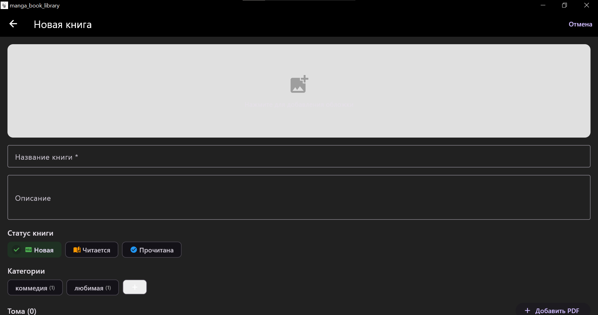
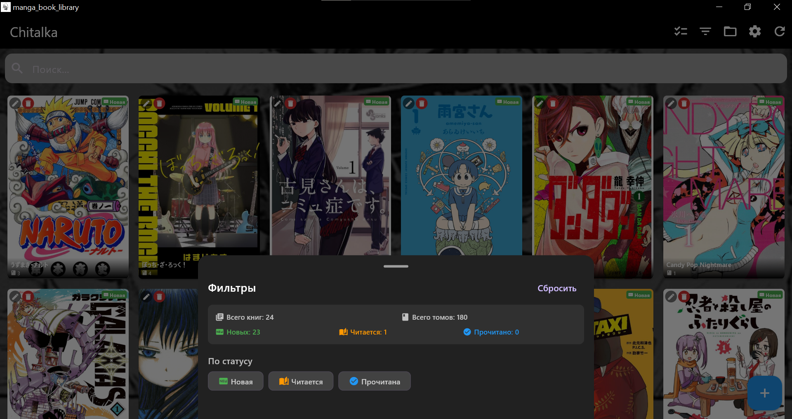
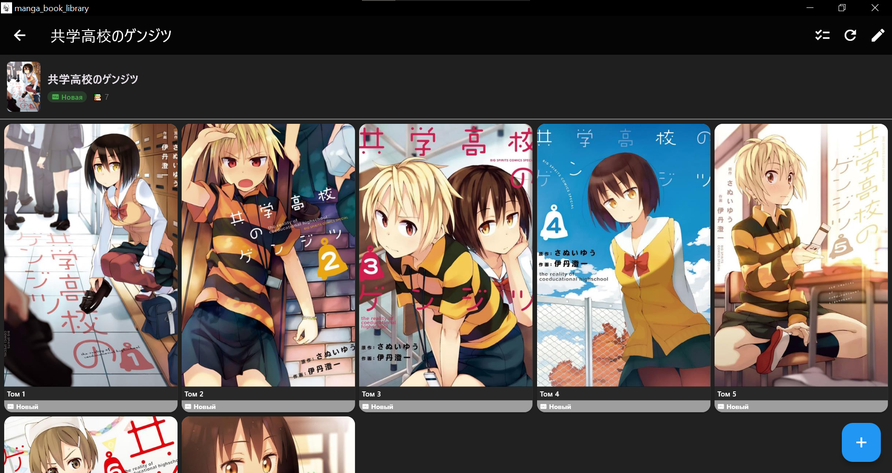

# 📚 Manga Book Library

> **Ваша личная библиотека манги и книг в одном месте.**

Мне надоело, что мои книги хранятся где попало — в облаке, на флешке, на SSD и на разных устройствах. Поэтому я создал это приложение, в котором все мои книги будут удобно собраны в общую библиотеку.

---

## ✨ Возможности

- 📖 **Чтение PDF** — полноценная читалка с зумом и прокруткой
- 🖼️ **Обложки для книг и томов** — загружайте свои обложки
- 📂 **Удобная структура** — папка `library/` рядом с приложением
- 🏷️ **Категории и фильтры** — сортируйте книги по жанрам
- 📊 **Статусы чтения** — Новая / Читается / Прочитана
- 🔖 **Закладки** — сохраняйте прогресс чтения
- 📥 **Импорт библиотеки** — автоматическое добавление целых папок с мангой
- 🎨 **Сменный фон** — настраивайте внешний вид приложения
- 🌙 **Тёмная тема** — комфортное чтение в любое время

---

## 🖥️ Системные требования

- Windows 10 / 11 (64-bit)
- Flutter SDK (для разработки)

---

## 🚀 Установка и запуск

### Для пользователей (готовое приложение)

1. Скачайте последнюю версию на странице [Releases](https://github.com/gadqikulievg0-byte/manga-book-library/releases)
2. Распакуйте архив или запустите `manga_book_library.exe`
3. Наслаждайтесь чтением!

### Для разработчиков

```bash
# 1. Клонировать репозиторий
git clone https://github.com/gadqikulievg0-byte/manga-book-library.git

# 2. Перейти в папку проекта
cd manga_book_library

# 3. Установить зависимости
flutter pub get

# 4. Запустить приложение
flutter run -d windows
```

---

## 🏗️ Сборка приложения

### Windows
```bash
flutter build windows --release
```

### Android
```bash
flutter build apk --release
```

---

## 📸 Скриншоты

### 📚 Главный экран
*Библиотека со всеми книгами в виде сетки с обложками*



---

### 📖 Читалка
*Удобный просмотр PDF с зумом и прокруткой*



---

### ✏️ Редактор книг
*Добавление и редактирование книг, томов и обложек*



---

### 🏷️ Категории и фильтры
*Удобная сортировка по жанрам и статусам*



---

### 📚 Пример книги
*Просмотр информации о книге и списка томов*



---

## 📁 Структура библиотеки

Приложение автоматически создает папку `library/` рядом с исполняемым файлом:

```
library/
└── Название_манги/
    ├── cover.jpg                 # Обложка манги
    ├── info.txt                  # Метаданные
    ├── covers/                   # Обложки томов
    │   ├── volume_1.jpg
    │   ├── volume_2.jpg
    │   └── ...
    ├── том_1.pdf
    ├── том_2.pdf
    └── ...
```

### Формат info.txt
```
TITLE: Название манги
DESCRIPTION: Описание манги
CATEGORIES: Жанр1, Жанр2, Жанр3
STATUS: new/reading/read

VOLUMES:
  1: том_1.pdf|new
  2: том_2.pdf|reading
```

---

## 🛠️ Используемые технологии

| Технология | Назначение |
|------------|------------|
| **Flutter** | Фреймворк для кроссплатформенной разработки |
| **Dart** | Язык программирования |
| **Hive** | Локальная NoSQL база данных |
| **Syncfusion PDF Viewer** | Рендеринг PDF-файлов |
| **GetX** | Управление состоянием и навигация |

---

## 📝 Планы на будущее

- [ ] Поддержка macOS и Linux
- [ ] Онлайн-синхронизация библиотеки
- [ ] Поиск по содержимому PDF
- [ ] Поддержка EPUB и CBZ
- [x] Настраиваемые темы оформления
- [ ] Экспорт и импорт библиотеки

---

## 🤝 Вклад в проект

Проект открыт для сотрудничества! Если вы нашли баг, хотите предложить улучшение или добавить новую функцию — буду рад любой помощи.

- 🐛 [Сообщить об ошибке](https://github.com/gadqikulievg0-byte/manga-book-library/issues)
- 💡 [Предложить идею](https://github.com/gadqikulievg0-byte/manga-book-library/issues)
- 🔧 [Сделать Pull Request](https://github.com/gadqikulievg0-byte/manga-book-library/pulls)


## 🙏 Благодарности

Спасибо всем, кто пользуется проектом, находит баги и помогает с развитием. Ваша поддержка — главная мотивация делать приложение лучше!


## 📚 Читайте с удовольствием!
